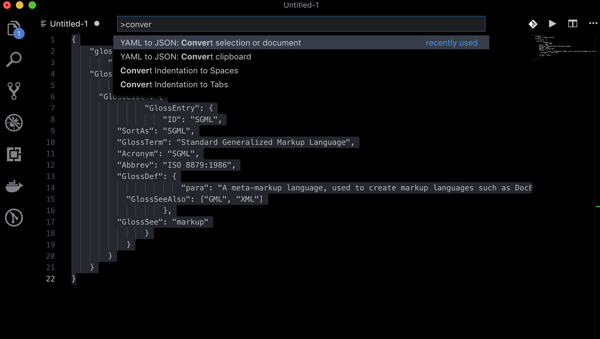

# YAML to JSON

> Convert between YAML and JSON in the editor

 

This extension makes two commands available: 

1. convert a selection / document in the open editor
2. convert the content of the clipboard buffer. 

These commands autodetect the input format, so if you have YAML in the clipboard, the convert clipboard command will output JSON.

This extension is adapted from https://github.com/buianhthang/vscode-xml2json/

## Extension settings

`yamlExpansionDepth`: with deeply nested structures, YAML expansion can produce a lot of whitespace indentation. To keep lines from going off the screen horizontally, you can set the maximum depth of the structure to expand before switching to a more compact inline format.The default value is `6`.
